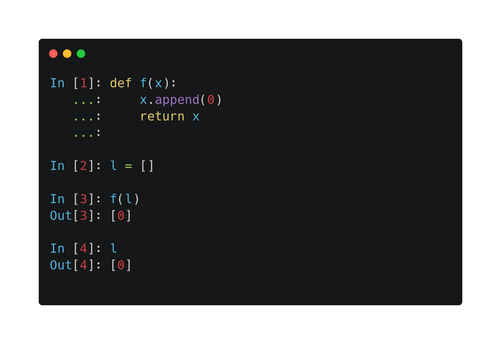
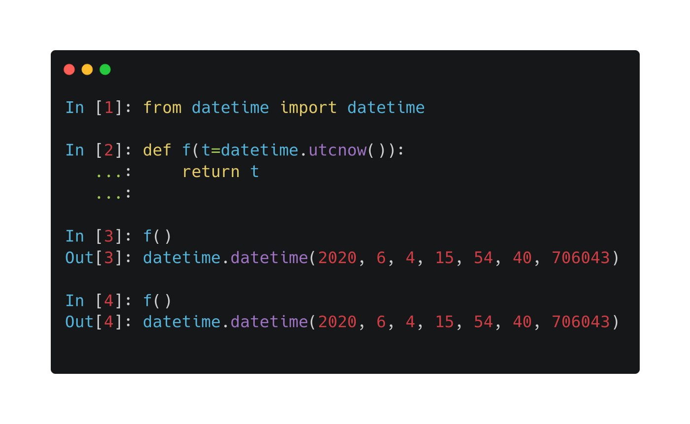
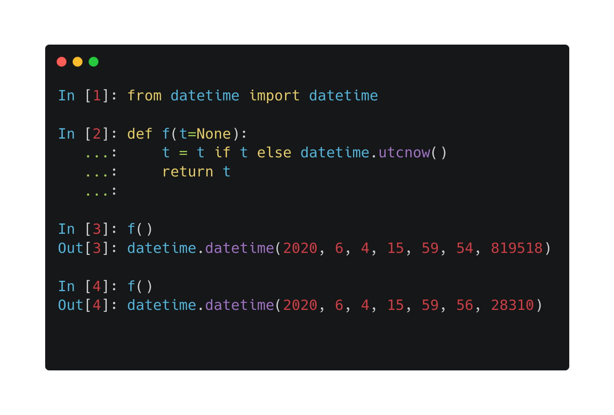
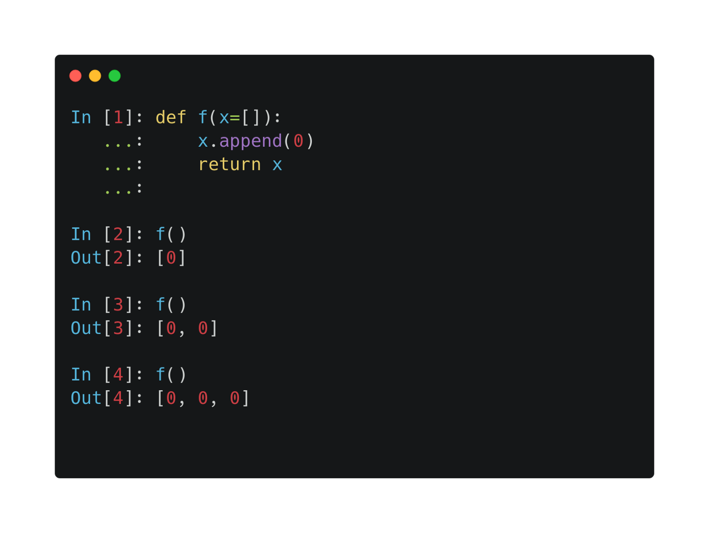
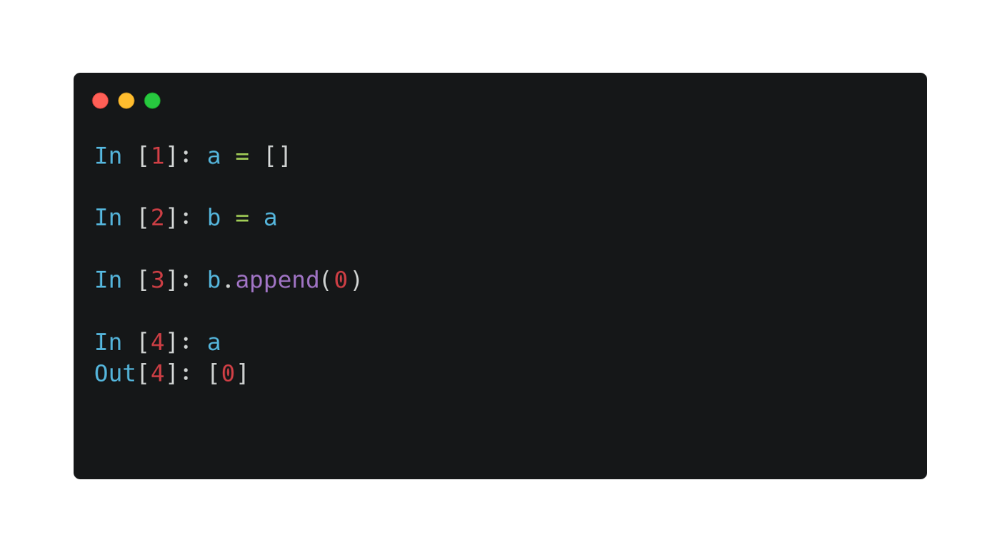
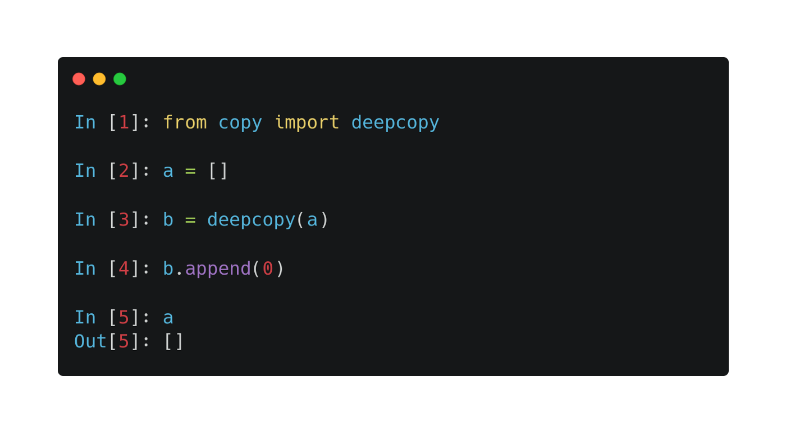

<h1 align='center'> 7 Python mistakes all beginner developers make — and how to avoid them</h1>

**1. Functions with side effects**

Since Python is not a purely functional language like Haskell, functions can make side effects. Strictly speaking, this is not a mistake, but it is easy to unintentionally mess things up. The example below demonstrates the issue.



In Python, objects are reference types. So when you pass a list as an argument, a reference is passed instead of the value. This implies that if you alter them in a function, the changes will be reflected outside.

This can lead to some very nasty surprises and hours of debugging. (See my introduction.) Watch out for these and save yourself the trouble early.

**2. Function calls in default arguments**

Default arguments can be tricky to use sometimes. Take a look at the following.



Why is the return value same for every call? The reason is that Python evaluates the expressions in default arguments when the function is defined. If you want to dynamically generate default arguments, you can do the following.



**3. Mutable default arguments**

This problem is a combination of the above two. Have you ever encountered the following scenario?



There are two things happening here.

Python evaluates the expression [] when the function is defined. (This is equivalent of calling list().) The reference of this object is bound to the argument. Thus, whenever you call the function, the same object will be used. So, using mutable objects as default arguments is not a good idea. You should never do that.

**4. Unintended reference assignments**

As we have seen, every object is a reference type in Python. This can cause some confusion besides passing them to functions. See this following example:



When you execute b = a, you actually store the reference of a. Thus, a and b points to the same object. To solve this, you should use the built-in deepcopy function. This recursively copies all value type attributes to the new variable.



If you try the same with integers instead of list, everything behaves like you would expect. The reason is that integer types are immutable, so you overwrite the reference when you change them.

**5. from something import \***

I know, we all did this at one point. There are several disadvantages of this.

First, functions in different namespaces can have the same name, causing confusion throughout your code base.

Second, when you import a module in Python, all code in that module will be executed. This can significantly slow things down if there are lots of submodules to import. So, if you only import NumPy to generate random numbers, you are probably better off with

```python3
from numpy.random import random
```

than

```python3
import numpy as np
```

**6. Joining paths with string concatenation**

Suppose that you have to open a file called data.csv from the folder given by the variable data_folder. How should determine the file path? If you are doing

```python3
data_path=data_folder+"/data.csv"
```

then you are not doing it right. This would not work on Windows for instance. You might not experience yourself, but your colleagues using different development setups will feel the pain for sure.

To solve this, you should either use pathlib, Python’s built in tool, or simply the os.path.join function:

```python3
data_path=os.path.join(data_folder,"data.csv")
```

**7. Low test coverage**

This is a high level issue. Especially when you are a beginner, the benefits of unit testing is not clear. However, every seasoned developer can tell you that it is absolutely essential. Working with untested code is like playing whack-a-mole: fix one bug, introduce another.

Avoiding this starts from the very beginning of your project. As soon as you add a feature (or a function even), you should write test cases to validate the implementation. There are several great libraries for this, for example the built-in unittest or the very popular pytest.

You should seriously invest time into testing your code. It might take some time to do that, but it is a long term investment. You will save much more time of debugging.

In brief, these are the seven most painful mistakes you can make in Python. You will certainly encounter some more during your quest to Python proficiency. However, with this guide under your belt, you will have knowledge to avoid the most frequent ones.
